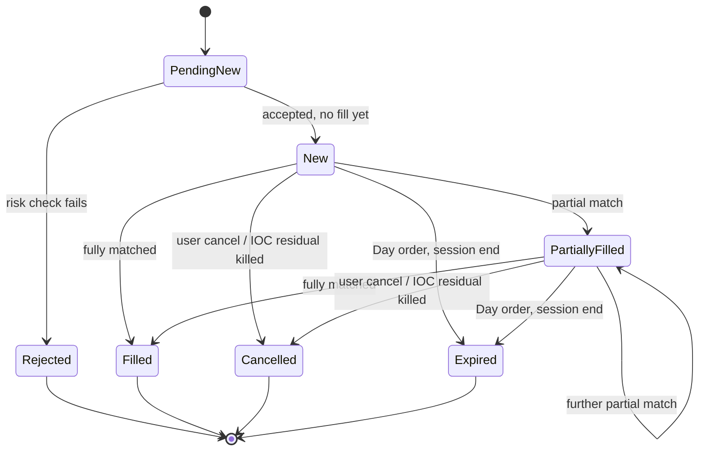
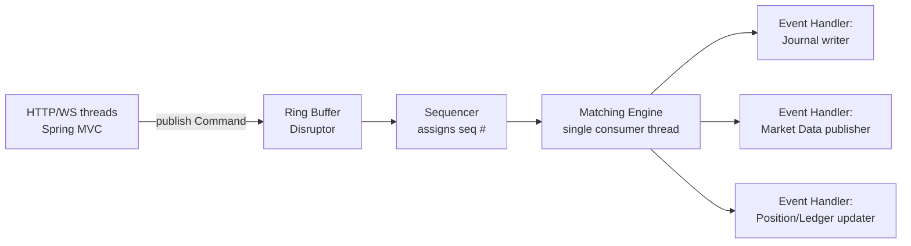
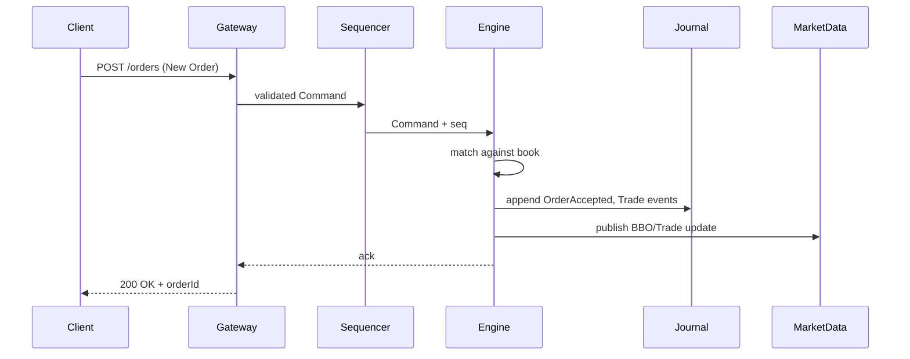
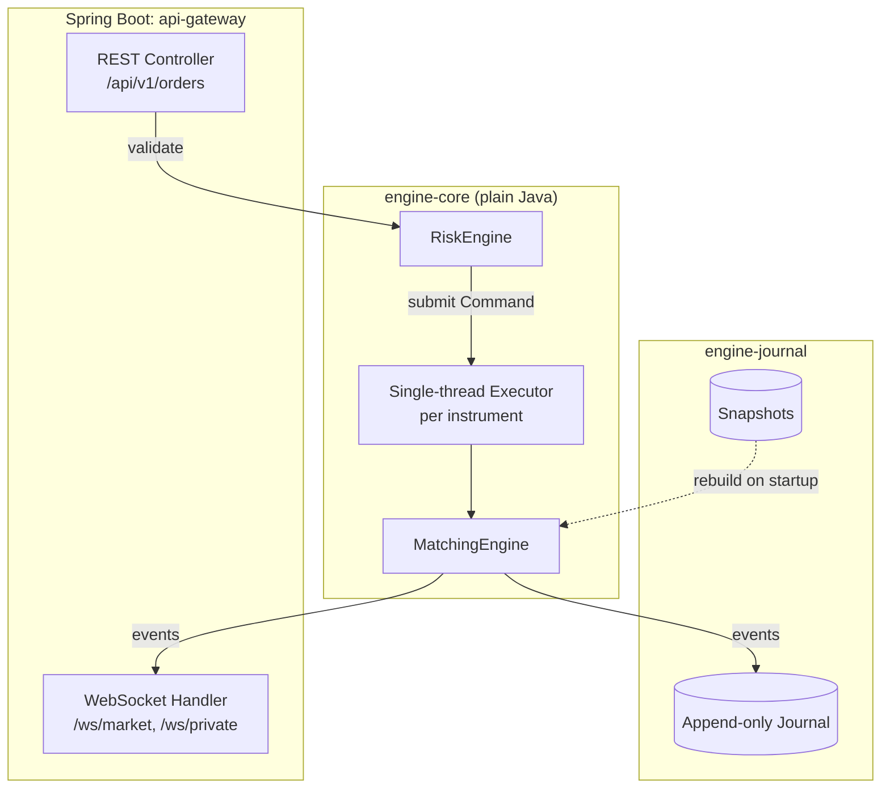

# NGGEEN — Complete Build & Learning Guide
### Java 21 + Spring Boot | From Frontend Dev to Trading-Systems-Ready

**Goal of this document:** not just to  ship a demo, but to make sure that when a
market-infrastructure or trading-systems interviewer asks me *"walk me through how your
matching engine guarantees determinism"* or *"why didn't you use `double` for price?"* — i'll
have a real, defensible answer, because i built it and understood *why*, not just *how*.

---

## 0. How to use this guide

1. **Domain knowledge** — what a CLOB actually does and why (Part 1)
2. **Systems knowledge** — determinism, concurrency, low-latency patterns (Part 2)
3. **Java-specific idioms** used in real trading shops (Part 3)

Read Parts 1–2 fully before writing code. They're the part that's actually hard to pick up.

---

## Part 1 — Domain Knowledge: What an Exchange Actually Does

### 1.1 The Core Object: The Order Book

An order book is two sorted lists of resting orders for one instrument:

- **Bids** (buy orders) — sorted **descending** by price (highest buyer wins priority)
- **Asks** (sell orders) — sorted **ascending** by price (lowest seller wins priority)

Within the same price, orders are FIFO by arrival time — this is **price-time priority**.

```
ASKS (sell side)          <- lowest ask = "best offer"
  101.50   x 200
  101.20   x 500
  101.00   x 300  <-- BEST ASK
────────────────────────  SPREAD = 101.00 - 100.90 = 0.10
  100.90   x 400  <-- BEST BID
  100.80   x 600
  100.50   x 150
BIDS (buy side)            <- highest bid = "best bid"
```

- **BBO** (Best Bid/Offer) = top of book = {100.90, 101.00}
- **Spread** = best ask − best bid
- **Depth** = quantity available at each level (Level 2 = full book, Level 1 = BBO only)
- **Aggressor / Taker** = the incoming order that crosses the spread and executes immediately
- **Maker / Resting order** = the order sitting in the book waiting to be matched

This maker/taker distinction is *everywhere* in real exchanges (fee models are usually
maker-rebate / taker-fee) — bake it into your `Trade` model from day one.

### 1.2 Order Types (and what they actually mean under the hood)

| Type | Behavior |
|---|---|
| **Market** | Execute immediately at best available price(s), no price limit. Walks the book until filled or book exhausted. |
| **Limit** | Execute at specified price or better. If it crosses the book, fills like a marketable limit order; otherwise rests. |
| **Stop** | Dormant order. Becomes a **Market** order once the last trade price (or BBO) touches the stop price. |
| **Stop-Limit** | Same trigger as Stop, but becomes a **Limit** order (not Market) once triggered. |

### 1.3 Time-in-Force (TIF)

| TIF | Meaning |
|---|---|
| **GTC** | Good-Til-Cancelled — rests indefinitely until filled or manually cancelled |
| **IOC** | Immediate-Or-Cancel — fill whatever is possible right now, cancel the rest |
| **FOK** | Fill-Or-Kill — fill the *entire* quantity immediately, or reject the whole order (no partial) |

**The trap:** FOK requires you to *check* whether the full quantity is fillable **before**
mutating the book at all. If you walk-and-match greedily like a normal marketable order and
only *then* discover you can't fill it all, you've already mutated state you now have to roll
back. Real implementations do a **dry-run scan** first:

```
function canFullyFill(order, book):
    remaining = order.quantity
    for level in book.oppositeSide (in priority order):
        if remaining <= 0: break
        if not priceCrosses(order, level.price): break
        remaining -= level.totalQuantity
    return remaining <= 0
```//
Only if this returns true do you run the actual matching pass.

### 1.4 Order State Machine



### 1.5 Trade Lifecycle → Clearing → Settlement

This is the part frontend/backend devs usually skip, but it's core finance knowledge:

1. **Execution** — the match happens, a `Trade` is generated (this is what your matching
   engine does)
2. **Clearing** — a clearinghouse (in real markets, e.g. DTCC/NSCC) becomes the counterparty
   to both sides (novation), nets obligations across the day
3. **Settlement** — actual transfer of cash and securities. Real equities settle **T+1**
   (trade date + 1 business day) as of 2024's US move from T+2. Crypto/some venues settle
   **T+0** (instant).

For your project, "clearing" can just mean: **at end of day, net all trades per account per
instrument into a single position delta and cash delta**, then mark it "settled." You don't
need real DVP (delivery-vs-payment) — just simulate the state transition
`Executed → Cleared → Settled` on your `Trade` object. This teaches the *concept* which is
what interviewers care about.

### 1.6 Why Matching Is Single-Threaded (this is a favorite interview question)

If multiple threads mutate the same order book concurrently, the order in which two
simultaneously-arriving orders get matched becomes non-deterministic — replaying the same
input log could produce **different trades** depending on thread scheduling. That destroys:

- **Auditability** (regulators need to reconstruct exactly what happened)
- **Recovery** (you can't rebuild state from the journal reliably)
- **Testability** (you can't write a deterministic replay test)

So real exchanges (Nasdaq, LMAX, most crypto exchanges) run **one matching thread per
instrument/shard**, fed by a **totally ordered command queue**. Concurrency is achieved by
*sharding across instruments*, not by parallelizing within one order book.

---

## Part 2 — Systems Knowledge You Need

### 2.1 The Golden Rule: Never Use `double` for Money

```java
// WRONG — binary floating point cannot represent 0.1 exactly
double price = 100.10;

// RIGHT — Option A: BigDecimal with fixed scale
BigDecimal price = new BigDecimal("100.10").setScale(2, RoundingMode.UNNECESSARY);

// RIGHT — Option B (what real low-latency engines use): scaled long/int "ticks"
// e.g. tick size = 0.01 → store price as an integer number of ticks
long priceTicks = 10010; // represents 100.10 given tickSize=0.01
```

For your matching hot path, **prefer scaled longs** (Option B). `BigDecimal` allocates on
every operation, which fights your "allocation-free hot path" non-functional requirement.
Convert to `BigDecimal`/decimal strings only at the API boundary (JSON serialization).

### 2.2 The Disruptor Pattern (what LMAX actually built this for)

This is *the* canonical reference architecture for a Java matching engine, and namedropping
it correctly in an interview is a strong signal. LMAX (a real FX/crypto exchange) open-sourced
the **LMAX Disruptor** — a lock-free ring buffer — specifically to solve this problem:

> How do you get single-threaded-deterministic matching *and* high throughput, without the
> latency cost of locks or the complexity of a naive queue?



Key idea: **many producer threads** (your REST/WebSocket handlers) can publish commands
concurrently into the ring buffer, but there's exactly **one consumer thread** per instrument
shard that processes them strictly in order. Downstream "event handlers" (journal, market
data, ledger) can consume the *output* events in parallel since they're read-only against
the already-decided trade outcome.

You don't have to use the actual LMAX Disruptor library — a `java.util.concurrent
.LinkedBlockingQueue` + a single dedicated `Thread`/`ExecutorService` (single thread pool)
per instrument gets you 90% of the architectural lesson with far less complexity. Use the
real Disruptor library only as a stretch goal once the simple version works.

**Minimal viable version:**

```java
// One of these per instrument shard
ExecutorService matchingExecutor = Executors.newSingleThreadExecutor();

// REST controller just does:
matchingExecutor.submit(() -> matchingEngine.process(command));
```

This alone teaches you the core lesson: **decouple request-handling concurrency from
matching-engine determinism.**

### 2.3 Event Sourcing (why, not just how)

Instead of storing "current state" (mutable order book rows in a DB), you store the
**sequence of commands/events that produced that state**. Current state is always a
*derived, rebuildable* view.



**Recovery = load latest snapshot + replay journal events from snapshot's sequence number
onward.** This is the property that makes your system "regulatory-grade" — you can
reconstruct *exactly* what the book looked like at any point in time, and prove no trade was
lost or duplicated.

**Determinism test you should absolutely write:**
```java
@Test
void replayingSameCommandLogProducesIdenticalTrades() {
    List<Trade> run1 = replayCommandLog(commandLog);
    List<Trade> run2 = replayCommandLog(commandLog); // fresh engine instance
    assertThat(run1).isEqualTo(run2);
}
```

### 2.4 Testing Strategy (this is what separates a toy from a portfolio piece)

| Test type | What it proves | Example |
|---|---|---|
| **Unit** | Individual matching rules | "IOC order with no match cancels immediately" |
| **Golden scenario** | Classic textbook cases | Partial fill, FOK reject, self-trade prevention |
| **Property-based / fuzz** | Invariants hold under random input | Book never crosses; total quantity conserved; sequence numbers strictly increasing |
| **Replay determinism** | Same input → same output, always | See 2.3 above |
| **Recovery** | Snapshot + replay rebuilds exact state | Kill engine mid-stream, recover, compare book state |

Use **jqwik** or plain randomized loops for property-based tests in Java. This single section
of your GitHub repo (a `ReplayDeterminismTest` + a `PropertyBasedMatchingTest`) will do more
to impress a trading-systems interviewer than the entire frontend.

---

## Part 3 — Java/Spring-Specific Architecture

### 3.1 Module Boundaries (build it so the core is extractable)

```
exchange-engine/
├── engine-core/            # PURE Java, zero Spring deps — this is your portfolio centerpiece
│   ├── model/               # Order, Trade, PriceLevel, OrderBook, Account
│   ├── matching/             # MatchingEngine, price-time algorithm, FOK dry-run
│   ├── risk/                  # Pre-trade checks
│   └── events/                 # Command & Event types (sealed interfaces)
├── engine-journal/          # Persistence: append-only log + snapshotting
├── engine-marketdata/        # BBO/depth/trade event → outbound message translation
├── api-gateway/               # Spring Boot: REST + WebSocket, auth, rate limiting
│   ├── controller/
│   ├── websocket/
│   └── config/
└── admin-service/               # Spring Boot: instrument mgmt, kill switch, risk config
```

**Why `engine-core` has zero Spring dependencies:** it's the piece you'll actually show off.
Keeping it framework-free proves you understand separation of concerns, makes it trivially
unit-testable (no Spring context startup), and means you could theoretically swap Spring for
anything else later without touching matching logic.

### 3.2 Command/Event Types — use `sealed interface` (Java 21)

```java
public sealed interface Command permits NewOrder, CancelOrder, ReplaceOrder {}

public record NewOrder(
    String clientOrderId, String accountId, String instrumentId,
    Side side, OrderType type, long priceTicks, long stopPriceTicks,
    long quantity, TimeInForce tif, long submittedAtNanos
) implements Command {}

public sealed interface EngineEvent
    permits OrderAccepted, OrderRejected, TradeExecuted, OrderCancelled {}

public record TradeExecuted(
    long sequenceNumber, String tradeId, String instrumentId,
    long priceTicks, long quantity,
    String buyOrderId, String sellOrderId, Side aggressorSide,
    long timestampNanos
) implements EngineEvent {}
```

Sealed interfaces + records let you use exhaustive `switch` pattern matching in your event
handlers (journal writer, market data publisher) — no `instanceof` chains, compiler-enforced
completeness. This is idiomatic modern Java and worth highlighting in code review / interviews.

### 3.3 Data Structures for the Book

```java
// Price levels: TreeMap gives you sorted iteration + O(log n) insert
// Bids: descending comparator. Asks: natural (ascending) order.
NavigableMap<Long, PriceLevel> bids = new TreeMap<>(Comparator.reverseOrder());
NavigableMap<Long, PriceLevel> asks = new TreeMap<>();

// Within a PriceLevel: FIFO queue (ArrayDeque or intrusive doubly-linked list)
class PriceLevel {
    long priceTicks;
    long totalQuantity;
    Deque<RestingOrder> orders = new ArrayDeque<>(); // FIFO: addLast, peekFirst
}

// O(1) cancel/replace lookup
Map<String, RestingOrder> orderIndex = new HashMap<>(); // orderId -> node
```

For a learning project, `TreeMap` + `ArrayDeque` is perfectly real — production engines use
intrusive linked lists and array-indexed price levels to avoid allocation, but that's a later
optimization pass, not a Phase 1 concern.

### 3.4 Spring Boot Wiring Sketch



- REST/WS controllers stay thin — validate shape, auth, then hand off.
- Risk checks happen **before** the command is submitted to the matching executor
  (fail-closed, as your original doc correctly specifies).
- WebSocket fan-out subscribes to the engine's event stream (Spring's
  `SimpMessagingTemplate` over STOMP, or a raw `WebSocketSession` broadcaster — raw is more
  educational, STOMP is faster to wire up).

---

## Part 4 — Revised Phased Plan (Finance-Learning-Optimized)

Reordered from your original doc to front-load the concepts interviewers actually probe.

| Phase | Focus | Deliverable |
|---|---|---|
| **1** | Core matching, single instrument, Limit+Market, GTC/IOC, price-time priority | Pure Java `engine-core`, console-logged trades, **first replay-determinism test passing** |
| **2** | FOK/Stop/Stop-Limit + full TIF, order state machine, self-trade prevention | Golden-scenario test suite covering every order-type/TIF combination |
| **3** | Event journal + snapshot + recovery | Kill the process mid-run, restart, prove state rebuilds identically |
| **4** | Risk engine + accounts/positions | Pre-trade buying-power checks, post-trade position/cash updates |
| **5** | Spring Boot REST + WebSocket gateway | Wire `engine-core` behind real endpoints, multi-instrument sharding |
| **6** | Market data (BBO/depth/trades, snapshot+delta) | Real-time feed a UI could consume |
| **7 (stretch)** | Admin/kill-switch, metrics, LMAX Disruptor swap-in, simple frontend | Portfolio polish |

Notice: **the frontend is Phase 7, not Phase 1.** You already know how to build UI — spend
your scarce learning time where the actual gap is.

---

## Part 5 — Domain Knowledge Beyond the Code

To actually be conversant in interviews, know these cold (all conceptual, no code needed):

- **Why price-time priority vs pro-rata** — pro-rata (used in some futures markets) allocates
  fills proportionally across resting orders at a price level instead of FIFO; incentivizes
  large orders differently. Know the tradeoff exists even if you only implement FIFO.
- **Maker/taker fee models** — most exchanges rebate makers (liquidity providers) and charge
  takers (liquidity takers) to encourage tight spreads.
- **Circuit breakers / trading halts** — real exchanges halt trading on extreme volatility
  (e.g. limit-up-limit-down rules). Your "Halted" instrument status is a simplified version.
- **Opening/closing auctions** — real markets don't start continuous trading cold; they run a
  call auction to establish an opening price from accumulated pre-open orders. Your doc lists
  this as a stretch goal — it's genuinely a great one, and a common interview whiteboard topic.
- **Latency vocabulary** — "tick-to-trade latency," "wire-to-wire," matters a lot in HFT-adjacent
  roles even if your project runs at millisecond, not microsecond, scale.

**Recommended reading** (no need to search, these are stable references):
- *Trading and Exchanges* by Larry Harris — the standard text on market microstructure
- LMAX Disruptor technical paper/blog — "How to Do 100K TPS at Less than 1ms Latency"
- Nasdaq's public ITCH/OUCH protocol specs — real-world market data & order entry protocol design

---

## Quick Reference: What to Say in an Interview

> "I built a CLOB matching engine in Java with a framework-free core module, using
> price-time priority matching over a single-threaded-per-instrument event loop fed by a
> command queue — similar in spirit to the LMAX Disruptor pattern. State is event-sourced:
> every command and resulting trade is journaled, and I have deterministic replay tests that
> prove identical input sequences always produce identical trade output, which I used to
> validate recovery from snapshot+journal after a simulated crash."

That one paragraph, backed by actual working tests, will carry more weight than the entire
UI. Build accordingly.
